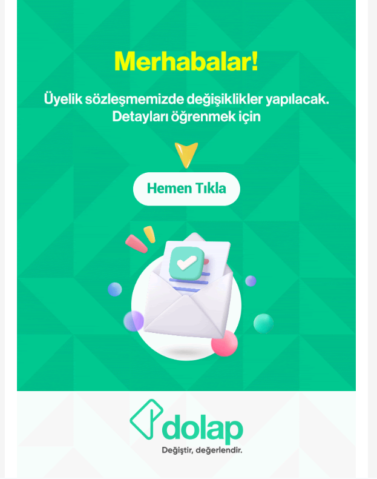

# Dolap.com Sözleşme Değişiklik Takipçisi

Dolap platformunun kullanıcı sözleşmesindeki değişiklikleri otomatik olarak takip eden sistem.

## Neden?

Dolap.com sözleşme değişikliklerinde aşağıdaki gibi bir e-posta gönderiyor. Ancak linke tıkladığınızda sadece güncel sözleşmeyi görüyorsunuz - **tam olarak neyin değiştiğini öğrenemiyorsunuz**. Komisyon oranları mı arttı? İade süreleri mi kısaldı? Bilemezsiniz.

Bu proje tam da bu sorunu çözüyor: Her değişikliği Git history'de saklıyor ve Gemini AI ile otomatik olarak özetliyor.



## Nasıl Çalışır?

1. GitHub Actions her gün saat 12:00 (TR) sözleşmeyi kontrol eder.
2. Değişiklik varsa Gemini API ile analiz yapar.
3. Değişiklikleri özetleyen commit mesajı oluşturur.
4. Git history üzerinden tüm değişiklikler takip edilebilir.

## Kurulum

### Gereksinimler

- Node.js 20+
- Gemini API Key

### Yerel Kurulum

```bash
npm install
```

### GitHub Secrets

Repository Settings > Secrets and variables > Actions > New repository secret:

- `GEMINI_API_KEY`: Google Gemini API anahtarı

## Kullanım

### Manuel Kontrol

```bash
# Sözleşmeyi indir
npm run fetch

# Değişiklik kontrolü (commit atar)
GEMINI_API_KEY=your_key npm run check
```

### GitHub Actions

- Otomatik: Her gün 12:00 TR
- Manuel: Actions > Sözleşme Değişiklik Kontrolü > Run workflow

## Dosya Yapısı

```
├── .github/workflows/check-update.yml  # GitHub Actions workflow
├── scripts/
│   ├── fetch-sozlesme.js               # Sözleşme indirme
│   ├── analyze-diff.js                 # Gemini ile analiz
│   └── check-update.js                 # Ana kontrol scripti
├── sozlesmeler/
│   └── kullanici-sozlesmesi.md         # Mevcut sözleşme (Markdown)
└── package.json
```

## Commit Mesajı Örneği

```
docs(sözleşme): Sözleşme güncellemesi - 2026-01-15

- Satıcı komisyon oranı %12'den %15'e yükseltildi.
- Yeni "Süper Satıcı B" kategorisi eklendi.
- İade süresi 48 saatten 24 saate düşürüldü.
```

## Kaynak

Sözleşme URL: https://dolap-agreement.s3.eu-central-1.amazonaws.com/current/kullanici-sozlesmesi.html
