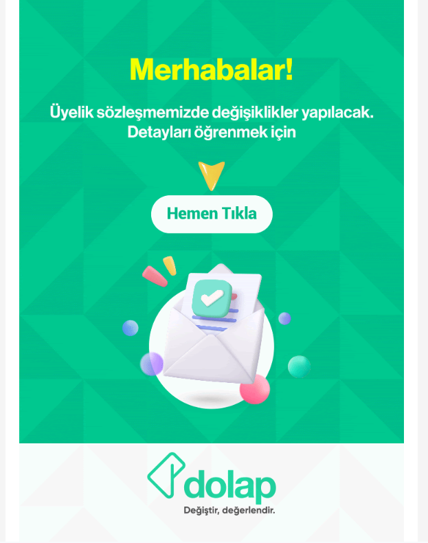

# Dolap.com Sözleşme Değişiklik Takipçisi

Dolap platformunun üyelik sözleşmesindeki değişiklikleri otomatik olarak takip eden sistem.

## Neden?

Dolap.com sözleşme değişikliklerinde aşağıdaki gibi bir e-posta gönderiyor. Ancak linke tıkladığınızda sadece güncel sözleşmeyi görüyorsunuz, **tam olarak neyin değiştiğini öğrenemiyorsunuz**. Komisyon oranları mı arttı? İade süreleri mi kısaldı? Bilemezsiniz.

Bu proje tam da bu sorunu çözüyor: her değişikliği Git history'de saklıyor ve Gemini AI ile otomatik olarak özetliyor.



## Nasıl Çalışır?

1. GitHub Actions her gün 06:00 UTC (09:00 TR) sözleşmeyi S3'ten indirir.
2. HTML'i Markdown'a çevirir ve depodaki versiyonla karşılaştırır.
3. Değişiklik varsa satır bazlı diff hesaplar ve Gemini API ile analiz eder.
4. Analizi commit mesajının gövdesine yazar ve push eder.
5. Değişiklik yoksa hiçbir şey yapmaz, commit atılmaz.

Değişikliklerin tamamı Git history üzerinden takip edilebilir.

## Kurulum

### Gereksinimler

- Node.js 20+
- Gemini API anahtarı ([Google AI Studio](https://aistudio.google.com/apikey))

### Yerel Kurulum

```bash
npm install
```

### GitHub Secrets

Repository Settings > Secrets and variables > Actions > New repository secret:

- `GEMINI_API_KEY`: Google Gemini API anahtarı

Bu secret olmadan workflow çalışır ama analiz adımı başarısız olur ve commit gövdesine "Otomatik analiz yapılamadı." yazılır.

## Kullanım

### Komutlar

| Komut             | Açıklama                                                     |
| ----------------- | ------------------------------------------------------------ |
| `npm run fetch`   | Sözleşmeyi indirir ve dosyaya yazar. Commit atmaz.           |
| `npm run check`   | Tam akış: indir, karşılaştır, analiz et, commit at.          |

`npm run fetch` API anahtarı istemez. `npm run check` çalıştığı depoda gerçek commit oluşturur, bu yüzden önce `git status` ile çalışma alanını kontrol edin.

```bash
# Sadece indir, commit atma
npm run fetch

# Değişiklik kontrolü, commit atar
GEMINI_API_KEY=your_key npm run check

# Değişiklik olmasa bile commit at
GEMINI_API_KEY=your_key FORCE_CHECK=true npm run check
```

Yerelde `git push` yapılmaz. Push yalnızca `GITHUB_ACTIONS` ortam değişkeninin set olduğu CI ortamında çalışır.

### Ortam Değişkenleri

| Değişken         | Zorunlu | Açıklama                                                    |
| ---------------- | ------- | ----------------------------------------------------------- |
| `GEMINI_API_KEY` | Evet    | Gemini API anahtarı. `npm run check` için gerekli.          |
| `FORCE_CHECK`    | Hayır   | `true` ise değişiklik olmasa bile commit atar.              |
| `GITHUB_ACTIONS` | Hayır   | CI ortamında otomatik set edilir, push'u etkinleştirir.     |

### GitHub Actions

- Otomatik: her gün 06:00 UTC (09:00 TR)
- Manuel: Actions > Sözleşme Değişiklik Kontrolü > Run workflow

Manuel tetiklemede `force` input'unu `true` yaparsanız değişiklik olmasa da commit atılır. Zamanlanmış çalışmalarda bu input boş kalır, yani force devre dışıdır.

## Değişiklikleri Görüntüleme

```bash
# Tüm sözleşme güncellemelerini listele
git log --oneline --follow sozlesmeler/kullanici-sozlesmesi.md

# Bir güncellemenin analiz özetini oku
git show --stat <commit>

# İki tarih arasındaki metin farkını gör
git diff <eski-commit> <yeni-commit> -- sozlesmeler/kullanici-sozlesmesi.md
```

## Commit Mesajı Örneği

Gerçek bir çalışmadan alınmış kısaltılmış örnek:

```
docs(sözleşme): Sözleşme güncellemesi - 2026-07-17

**1. Ücret/Komisyon Değişiklikleri**

* Madde 6.9.1 ve Ek 2: Kargo ödeme sorumluluğu eşikleri değişti.
  Eski: 250 TL ve altı sepetlerde satıcı veya alıcı öder.
  Yeni: 250 TL altı yalnızca alıcı, 250-400 TL paylaşımlı, 400 TL üzeri
  yalnızca satıcı öder.
* Satılırsa Öde Rozeti: Öne çıkarma bedeli %10'dan %15'e yükseltildi.

**2. Süre Değişiklikleri**

* Yeni Madde 18: Roket hakları tanımlandığı tarihten 30 gün içinde
  kullanılmazsa otomatik geri alınır.
```

Analiz şu öncelik sırasıyla üretilir: ücret ve komisyon, süreler, hak ve yükümlülükler, yeni maddeler, kaldırılan maddeler, diğer.

## Dosya Yapısı

```
├── .github/workflows/check-update.yml  # Günlük cron ve manuel tetikleme
├── scripts/
│   ├── fetch-sozlesme.js               # Sözleşme indirme
│   ├── analyze-diff.js                 # Diff hesaplama ve Gemini analizi
│   ├── check-update.js                 # Ana orkestratör
│   └── utils.js                        # Ortak yardımcı fonksiyonlar
├── sozlesmeler/
│   └── kullanici-sozlesmesi.md         # Güncel sözleşme (Markdown)
└── package.json
```

## Bağımlılıklar

| Paket                     | Kullanım                              |
| ------------------------- | ------------------------------------- |
| `@google/generative-ai`   | Gemini API istemcisi, `gemini-2.5-flash` |
| `node-html-markdown`      | HTML'den Markdown'a dönüşüm           |
| `diff`                    | Satır bazlı diff hesaplama            |

## Geliştirme Notu

Cron işi uzak dala kendi commit'lerini attığı için yerel dal sık sık geride kalır. Push etmeden önce `git pull --rebase` çalıştırın, aksi halde push reddedilir.

## Kaynak

Sözleşme URL: https://dolap-agreement.s3.eu-central-1.amazonaws.com/current/kullanici-sozlesmesi.html
